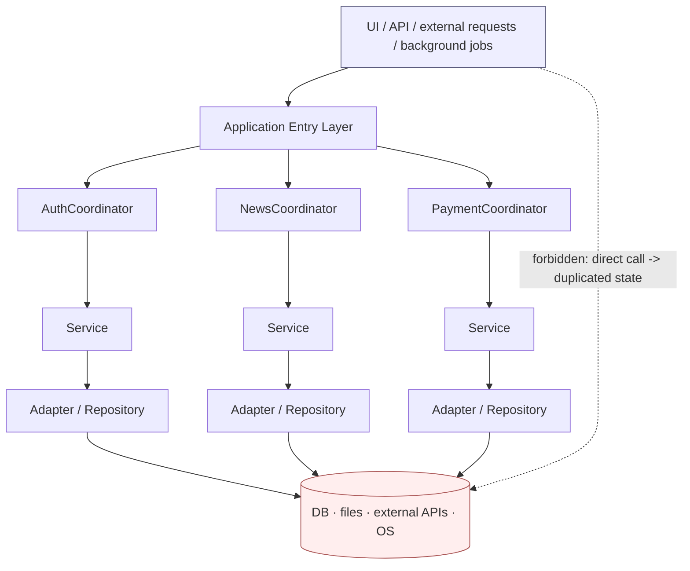
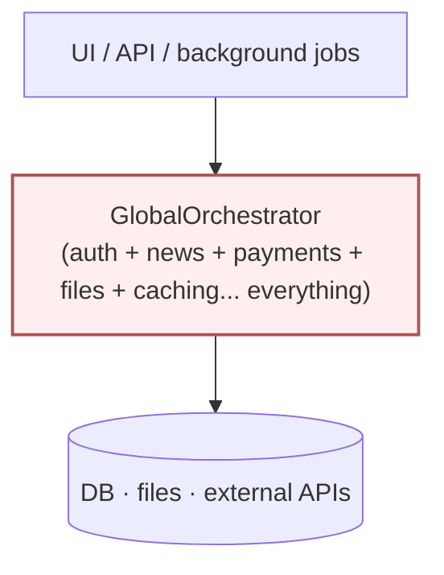
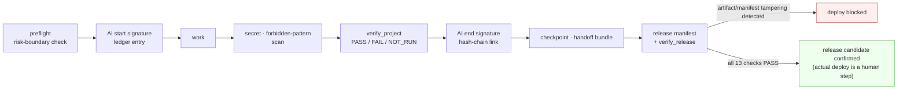

[한국어](README.ko.md) | **English**

# Airframe

*(working slug: `ai-project-structure-standard`)*

Leave an AI to keep writing code alone across many sessions, and it collapses
into one of two failure modes. The UI starts poking the DB and external APIs
directly from anywhere, and the same state gets duplicated all over the
place — or, in an attempt to prevent that, one giant global orchestrator is
born that swallows every domain's logic. Both are accidents that happen
because there's no structure.

There's a deeper problem underneath both. **An AI can say "tests passed,"
and until now there was no way to check whether that was true.** The AI (or
person) in the next session either had to trust that claim or verify
everything from scratch.

Airframe is the structural skeleton that sits under the code an AI writes —
the way an aircraft's airframe holds everything together. It enforces
layering, runs a preflight check before work starts, leaves a pilot's
signature and black-box record (a hash-chained ledger) on every piece of
work, and blocks any cargo that hasn't cleared verification at the gate.
This isn't abstract advice — it's enforced by scripts, schemas, templates,
and examples that actually run. Every command in this README was actually
executed to confirm it works.

It isn't tied to any specific language or framework. The standard's own
tooling (`scripts/`) is implemented in Python, but the layering, signing,
verification, and release principles apply to a project written in any
language.

## The problem this solves

When an AI writes code across many sessions, the same failures keep
recurring:

- As features grow, the UI ends up calling the DB and external APIs
  directly more and more, the same state gets duplicated in multiple
  places, and regressions follow.
- The attempt to prevent that produces a giant global orchestrator
  (GlobalOrchestrator) that absorbs every domain's logic, and the cost of
  changing anything explodes along with the bottleneck.
- There's no record of which AI verified which scope, so the next session
  (or the next AI) has no basis to trust prior work.
- There's no way to tell the claim "I ran the tests" apart from whether
  they were actually run.
- Unverified artifacts, or artifacts tampered with after verification, get
  deployed as-is.
- Deployments happen with no rollback path, so there's no way back when
  something breaks.

This repository doesn't address these as abstract recommendations. It
enforces them with executable scripts, schemas, templates, and examples.

## Why "Airframe"

The name isn't decoration — it's a direct mapping to the real structure.
Every term below is a tool that actually exists in `scripts/`.

| Aviation term | In this standard | Actual tool |
|---|---|---|
| Preflight | Risk-boundary check before starting work | `scripts/preflight.py` |
| Pilot signature / flight log | AI start/end signature | `scripts/sign_ai_session.py` |
| Black box (tamper-evident record) | Hash-chained ledger | `.ai/ledger.jsonl` |
| Shift-handoff briefing | Bundle for the next AI/session | `scripts/create_handoff.py` |
| Cargo manifest | Release artifact list + hashes | `scripts/create_release_manifest.py` |
| Control-tower gate | Pre-deploy verification pass/fail | `scripts/verify_release.py` |
| Emergency procedures | Rollback point, code/data rollback separation | `docs/ROLLBACK_STANDARD.md` |

One discipline underlies all of it: **anything not on the checklist stays
as NOT_RUN, not PASS.** You don't write down that you checked something you
didn't. That single rule runs through the entire standard.

## Structure and flow

### 1. Layered Coordinator — this is how you build it

Every domain gets its own independent Coordinator, and requests must pass
through this layer. The Coordinator only handles request normalization,
ordering, caching, and error normalization — actual file, DB, and external
API access is owned exclusively by the Adapter/Repository
(`docs/ARCHITECTURE_STANDARD.md`).



### 2. This is how you don't build it — the failure on the other side

Without structure, a project collapses one of two ways: the UI pokes the
DB/external APIs directly (the dashed line above) and state gets
duplicated, or every domain's logic gets swallowed by a single global
orchestrator, shown below. Both are things this standard forbids.



### 3. Sign → verify → release flow — this is why you can trust it

This is the actual gate a single piece of AI work has to pass through
before it becomes a release candidate. Every arrow corresponds 1:1 to a
real command in `scripts/` (the full mapping is in "Why Airframe" above).



The actual output for every stage (masked signature JSON, a reproduced FAIL
after tampering, etc.) is right there in the "AI signature example",
"Verification example", and "Release and rollback" sections below — this
diagram is the explanation, and what follows is the evidence.

## Core principles

- The central layer governs, but doesn't monopolize the actual work.
- The same state and every external boundary has exactly one clear owner.
- Work that wasn't recorded is treated as if it never happened.
- An unsigned AI change is never accepted as an official result.
- Git diffs and execution results outrank an AI's own account of what it did.
- A check that wasn't run is NOT_RUN, not PASS.
- Unverified artifacts don't get deployed, and an artifact that changed
  after verification gets re-verified.
- A change that can't be rolled back doesn't go live.
- Secrets never go into code, logs, Git, or a build.
- Existing working behavior is preserved while improving incrementally
  (no wholesale rewrites).

## Results, not claims

Every number and command in this document was obtained by actually running
it — this isn't an assertion, it's a reproducible result.

- `python -m pytest tests/ -q` → **154 tests passing** (covers every tool
  listed in "Actual commands" below, including the 15 regression tests
  added by the Phase 8 independent audit).
- The release gate actually blocks: change the contents of a file after it
  passed verification, and `artifact_hashes` fails on the next check — the
  reproduced result is right there under
  ["Release and rollback"](#release-and-rollback).
- The ledger is an append-only hash chain: editing a past entry causes the
  next write attempt to be rejected for integrity violation (see
  ["AI signature example"](#ai-signature-example)).
- All 3 examples (`examples/`) are actually runnable — copy the commands
  from this README and they work.

There's no need to exaggerate. A tool that writes NOT_RUN for anything it
didn't check has no reason to write PASS for something it didn't check
about itself.

## Installation

There are two ways to "apply" this repository to a project.

**A. Reference it as a skill** — leave this repository where it is, and
have it read `SKILL.md` during work. Call the scripts by absolute or
relative path.

```bash
python /path/to/ai-project-structure-standard/scripts/preflight.py --workspace .
```

**B. Copy only what your project needs** — at minimum, copy the following
into your project root.

```bash
cp -r scripts schemas <target-project>/
cp templates/AI_START_HERE.md templates/ARCHITECTURE.md templates/CURRENT.md \
   templates/STATUS.md <target-project>/
cp .ai-standard.example.yml <target-project>/.ai-standard.yml
```

Every tool works with safe defaults even without a `.ai-standard.yml` (or
`.json`/`.yaml`) — configuration is optional.

## Quick start

```bash
# 1) Check risk boundaries (is it a Git repo, protected branch, uncommitted changes, etc.)
python scripts/preflight.py

# 2) Sign the start of work
python scripts/sign_ai_session.py start --task "description of this task" \
  --allowed-scope "files you'll change" --forbidden-scope "files you won't touch"

# 3) ...do the work...

# 4) Secret / forbidden-pattern scans + project verification
python scripts/check_secrets.py
python scripts/check_forbidden_patterns.py
python scripts/verify_project.py

# 5) Sign the end of work and generate a handoff bundle
python scripts/sign_ai_session.py end --status success --tests-run "pytest" \
  --tests-passed "N" --tests-failed "0"
python scripts/create_handoff.py
```

## Applying to a new project

1. Copy `templates/AI_START_HERE.md`, `templates/ARCHITECTURE.md`,
   `templates/CURRENT.md`, `templates/STATUS.md` into your project root (or
   `docs/`) and fill in the values.
2. Copy `.ai-standard.example.yml` to `.ai-standard.yml` and fill in your
   project's risk level, protected branches, and verification commands.
3. Once the domains are decided, start with the Entry → Domain
   Coordinator → Service → Adapter layering from
   `docs/ARCHITECTURE_STANDARD.md`. Don't create a top-level Application
   Coordinator from the start (see `SKILL.md` §5-§6 for when one is
   actually warranted).
4. Copy `examples/python-desktop/` or `examples/web-service/` as a
   skeleton and just rename the domain (`docs/EXAMPLES.md` §5).
5. Follow the procedure in `SKILL.md` §7-§9 (sign → work → verify →
   handoff) for every unit of work.

## Applying to an existing project

Don't do a wholesale rewrite. Follow the 8 steps in
`docs/MIGRATION_GUIDE.md` (survey current call paths → find who owns each
piece of state → list direct calls and bypass paths → decide whether to
reuse an existing Coordinator/Gateway → centralize the highest-risk
boundaries first → migrate feature by feature → regression test → remove
the legacy path).

A runnable bad-example/good-example comparison lives in
`examples/existing-project-migration/`.

```bash
python examples/existing-project-migration/before/app.py   # bad: direct calls, duplicated state, swallowed errors
python examples/existing-project-migration/after/main.py A100 A101 A999  # improved
```

## Actual commands

| Purpose | Command |
|---|---|
| Check risk boundaries | `python scripts/preflight.py` |
| Sign start of AI work | `python scripts/sign_ai_session.py start --task "..."` |
| Sign end of AI work | `python scripts/sign_ai_session.py end --status success` |
| Checkpoint | `python scripts/checkpoint.py --name <name>` |
| Generate handoff bundle | `python scripts/create_handoff.py` |
| Secret scan | `python scripts/check_secrets.py` |
| Forbidden-pattern scan | `python scripts/check_forbidden_patterns.py` |
| Run project verification | `python scripts/verify_project.py` |
| Document sync check | `python scripts/check_document_sync.py` |
| Generate release manifest | `python scripts/create_release_manifest.py --version <version> --artifacts <files...> --rollback-point <point> --approved-by <name>` |
| Release gate check | `python scripts/verify_release.py` |
| Full test suite | `python -m pytest tests/ -q` |

Run any script with `--help` to see its full options (e.g.
`python scripts/preflight.py --help`).

## Repository structure

```text
ai-project-structure-standard/
├── README.md  LICENSE  SKILL.md  AGENTS.example.md  CHANGELOG.md  CONTRIBUTING.md
├── docs/
│   ├── ARCHITECTURE_STANDARD.md   GIT_STANDARD.md        SECURITY_STANDARD.md
│   ├── ERROR_STANDARD.md          RELEASE_STANDARD.md    ROLLBACK_STANDARD.md
│   ├── MIGRATION_GUIDE.md         EXAMPLES.md
│   ├── IMPLEMENTATION_PLAN.md     FILE_RESPONSIBILITIES.md   TEST_PLAN.md
│   └── DECISIONS/ADR-0001-layered-coordinator.md
├── templates/   (AI_START_HERE, ARCHITECTURE, CURRENT, STATUS, WORK_LOG,
│                 SESSION_HANDOFF, ERROR_CATALOG, RUNBOOK, DEPLOY_LOG,
│                 SECURITY, ADR_TEMPLATE, etc. — forms you copy into your project)
├── schemas/     (request/result/error/ai_signature/project_config/
│                 verification/release_manifest .schema.json)
├── scripts/     (common, preflight, sign_ai_session, checkpoint, create_handoff,
│                 check_secrets, check_forbidden_patterns, verify_project,
│                 check_document_sync, create_release_manifest, verify_release)
├── examples/
│   ├── python-desktop/               a notes CLI app (Entry→Coordinator→Service→Repository)
│   ├── web-service/                  a status service (Route→Coordinator→Service→Adapter)
│   └── existing-project-migration/   before (bad) / after (improved)
└── tests/       (13 files, `python -m pytest tests/ -q`)
```

## AI signature example

The output below was obtained by actually running these commands against a
temporary demo repository (paths and timestamps will differ in your
environment). Values are shown exactly as masked by
`scripts/common.mask_sensitive` — the raw secret never appears here or
anywhere else in this repository.

```bash
python scripts/sign_ai_session.py start --task "demo: edit the README example" \
  --provider anthropic --claimed-model claude-sonnet-5 --role implementer \
  --effort medium --allowed-scope "README.md" --forbidden-scope "none"
```

```json
{
  "kind": "start",
  "run_id": "run_20260804T2229360000_b92d35",
  "provider": "anthropic",
  "actual_model_id": "UNKNOWN",
  "claimed_model": "claude-sonnet-5",
  "role": "implementer",
  "branch": "feature/demo",
  "base_commit": "a4a5b084a79c3790331884e947cdc6ea0aefb045",
  "task": "demo: edit the README example",
  "allowed_scope": "README.md",
  "previous_entry_hash": "",
  "entry_hash": "9f09d788c1b38f97c2a63888636a66f9ee1535aa9261c8793450ceb6ec2f23fc"
}
ledger: <workspace>/.ai/ledger.jsonl
```

`actual_model_id` is always recorded as `UNKNOWN` unless it can be
confirmed via an environment variable (e.g. `AI_ACTUAL_MODEL_ID`) — an AI's
own self-report (`claimed_model`) is never treated as a verified value.

```bash
python scripts/sign_ai_session.py end --status success \
  --tests-passed "0" --tests-failed "0" --documents-updated "README.md"
```

```json
{
  "kind": "end",
  "run_id": "run_20260804T2229360000_b92d35",
  "status": "success",
  "end_commit": "a4a5b084a79c3790331884e947cdc6ea0aefb045",
  "diff_hash": "bb859cbb91163eb52170a92e2c104682b3514e1e95219ca81729286231e7f758",
  "changed_files": ["README.md", ".ai/"],
  "previous_entry_hash": "9f09d788c1b38f97c2a63888636a66f9ee1535aa9261c8793450ceb6ec2f23fc",
  "entry_hash": "a03880be5bfb89644a0e382e0b34d0ede0419d5e268974645c8e93c9d30e930c"
}
```

`entry_hash` links to the previous entry's `entry_hash` via
`previous_entry_hash`, forming a hash chain. Editing an existing entry in
`.ai/ledger.jsonl` breaks that link, and the next call to `append_ledger`
is rejected for integrity violation.

## Verification example

```bash
python scripts/verify_project.py
```

```text
verification: PASS  (commit: 8ee015c83c22, pass 5 / fail 0 / not_run 0)
  [PASS   ] verify:python: exit code 0
  [PASS   ] tests: exit code 0
  [PASS   ] secrets: exit code 0
  [PASS   ] forbidden_patterns: exit code 0
  [PASS   ] git_diff_check: exit code 0
result: <workspace>/.ai/verification.json
```

The result is saved to `.ai/verification.json`, following
`schemas/verification.schema.json`. Any check that wasn't run stays
`NOT_RUN` and is never counted as `PASS`.

```bash
python scripts/check_document_sync.py
```

```text
document sync: PASS  (pass 4 / fail 0 / not_run 2)
  [PASS   ] readme_references: all 21 README-referenced path(s) exist
  [NOT_RUN] required_documents: no required_documents configured
  [PASS   ] config_commands: config commands are non-empty
  [PASS   ] current_status: no contradiction between CURRENT and STATUS
  [PASS   ] status_evidence: evidence column is filled in for all PASS entries
  [NOT_RUN] error_codes: no project ERROR_CATALOG.md (templates/ is excluded as a form)
```

## Release and rollback

```bash
python scripts/create_release_manifest.py --version 0.1.0 --artifacts dist/app.txt \
  --verification .ai/verification.json --rollback-point <last known-good commit> \
  --approved-by "approver"
python scripts/verify_release.py
```

```text
verify_release: PASS  (release_id: rel_20260804T2337000000_1b44ae, version: 0.1.0, pass 13 / fail 0 / not_run 0)
  [PASS   ] worktree_clean  [PASS] manifest_exists  [PASS] source_commit_match
  [PASS   ] verification_exists  [PASS] verification_passed  [PASS] verification_hash
  [PASS   ] verification_run_match  [PASS] artifact_hashes  [PASS] total_hash
  [PASS   ] manifest_hash  [PASS] rollback_point  [PASS] human_approval
  [PASS   ] release_enabled
```

Change the artifact's contents after verification and run it again (an
actually reproduced result):

```text
verify_release: FAIL  (pass 12 / fail 1 / not_run 0)
  [FAIL   ] artifact_hashes: 1 artifact issue(s): dist/app.txt: hash mismatch (possible tampering)
```

Deleting the manifest file itself doesn't get you through either —
`manifest_exists` fails and blocks it (no evidence of a release candidate,
no way through the gate).

Once an artifact changes after verification, the prior approval is
automatically invalidated — there is no way to bypass this gate within
this standard's tooling. Rollback principles (separating code and data
rollback, keeping the last known-good version, no infinite retries on a
failed version) are in `docs/ROLLBACK_STANDARD.md`. Neither
`verify_release.py` nor `create_release_manifest.py` performs an actual
deployment, Git push, or GitHub Release — deploying after the gate passes
is a human step or a separate process.

## Non-goals

- Paid code-signing certificates, HSM, mandatory TPM, strong DRM
- Anti-debugging, packers, heavy obfuscation
- Antivirus features, process monitoring, hardware fingerprinting,
  commercial security products
- Lock-in to a specific language, framework, or cloud vendor
- Actually performing a deployment, Git push, or GitHub Release creation,
  or touching production data (none of this standard's scripts do any of
  this)
- Fully automated judgment of natural-language document content (only
  mechanically verifiable core inconsistencies are checked)

## Contributing

See `CONTRIBUTING.md`. Short version: issue/proposal → branch → change →
run tests/secrets/forbidden-patterns/verification → PR.

## License

MIT License — see `LICENSE`.
